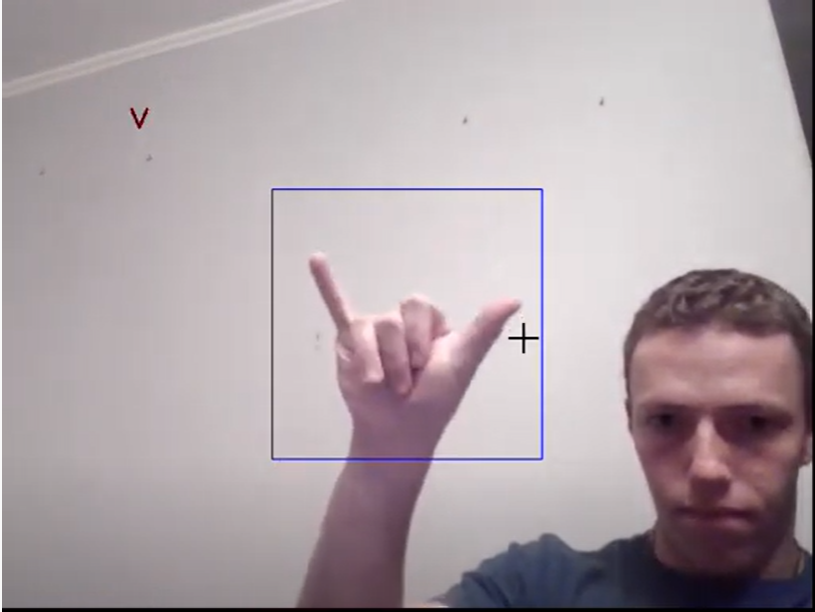

# Final Project for Computer Vision
We will be making a sign language spelling interpreter.

# DataSet
Sign Language MNIST - [@Kaggle](https://www.kaggle.com/datamunge/sign-language-mnist?select=amer_sign3.png)

# Example Youtube Video

